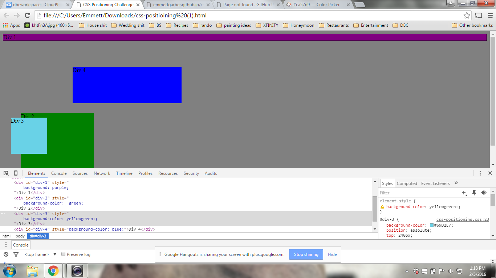
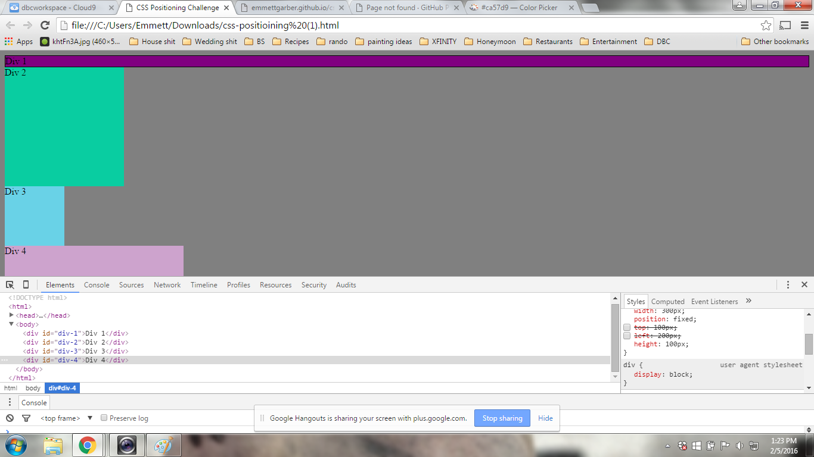
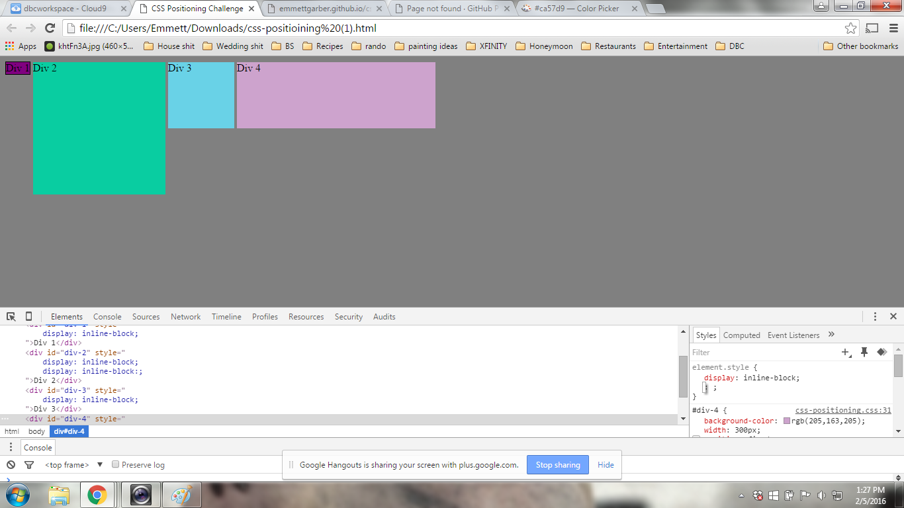
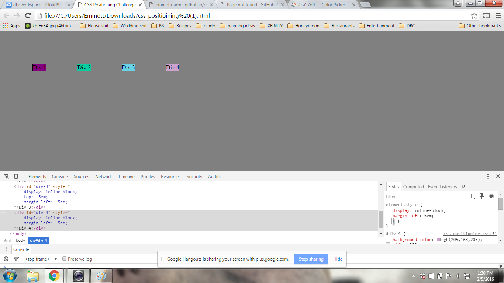
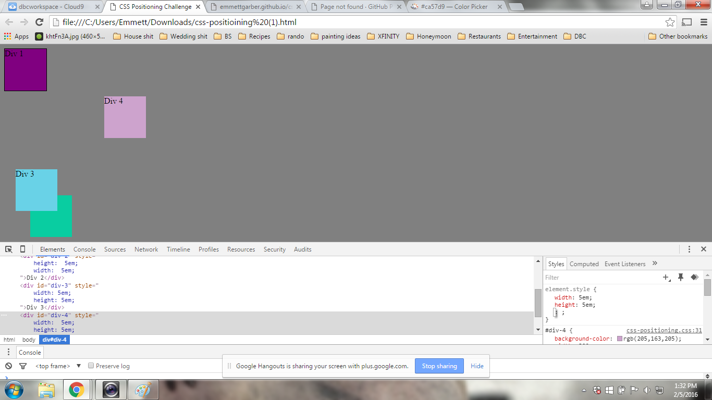
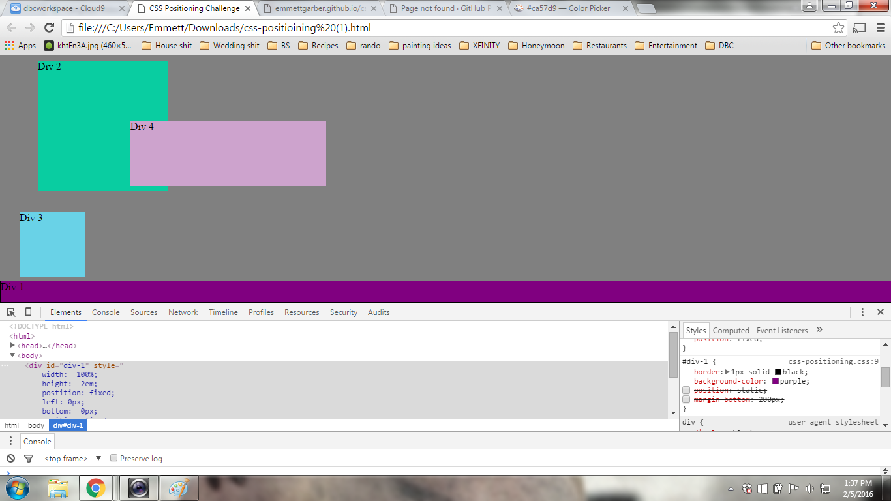
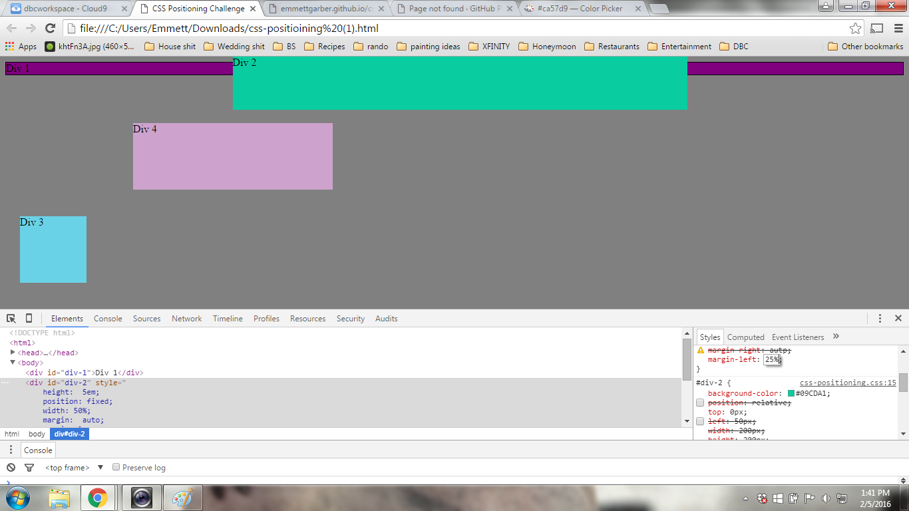
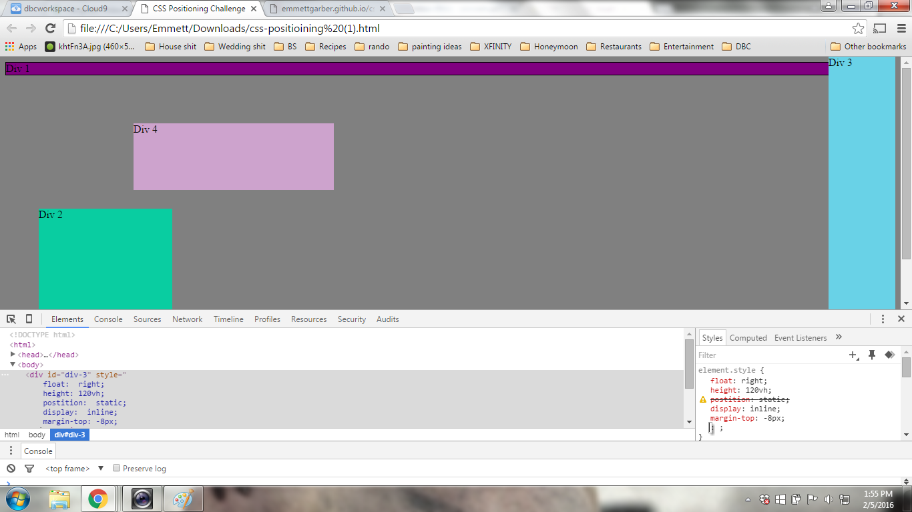
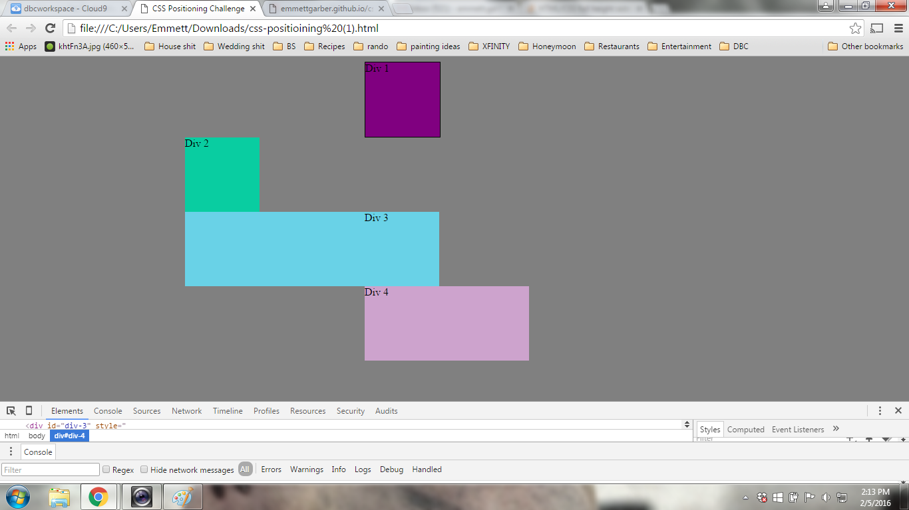

How can you use Chrome's DevTools inspector to help you format or position elements?
It allows one to see what elements are already in play, how you can adjust remove or add elements, and the addition of the toggle allows one to see
exactly how each value is affecting an element.

How can you resize elements on the DOM using CSS?
You can go in and adjust their height and width with px or em, you can add or subtract from the padding.

What are the differences between absolute, fixed, static, and relative positioning? Which did you find easiest to use? Which was most difficult?
Absolute values stay where they are in relation to other elements, fixed elements stay on the screen exactly where they are regardless of other elements,
static elements sit in the current heirarchy of where they are placed, relative elements are placed in response to other elements positioning.
Fixed is probably the easiest to use, where relative can be tricky to get a hang of.

What are the differences between margin, border, and padding?
Border is the edge around the element, padding is the space between the content of the element and the border, margin is the space between the border
and the edge or next element.

What was your impression of this challenge overall? (love, hate, and why?)
It was ok, it was good to see how each aspect affecting positioning though one or two of the challenges were frustrating as I could not
figure out what was stopping me from completeing the task.